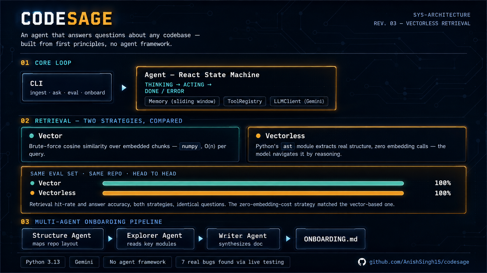
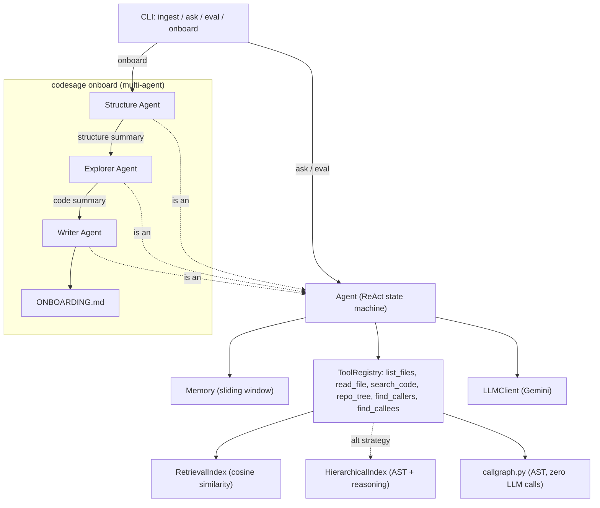

# CodeSage




An AI agent that answers questions about a codebase — citing exact
files and line ranges — built from scratch in Python (no LangGraph,
no CrewAI) so every piece of "how agents work" is code you can read,
not a framework you have to trust.

## What it does

Point CodeSage at a repo. It reads the files, chunks and embeds them,
and answers natural-language questions by retrieving relevant code and
reasoning over it with tools — the same ReAct-style loop used in
production coding assistants, hand-written here to make the mechanics
visible.

```bash
codesage ingest target_repo
codesage ask "how does the retry logic work?" --repo target_repo
```

## Architecture diagram



## Architecture

| Module | Responsibility |
|---|---|
| `llm.py` | Only module that talks to Gemini. Wraps `generate` (with tool calling) and `embed`, with rate-limit-aware retry. |
| `tools.py` | `ToolRegistry` — a `dict[str, Tool]` the agent dispatches through by name. Also `build_base_registry` (shared tool set) and `repo_tree` (recursive directory view). |
| `memory.py` | Bounded conversation history (`deque(maxlen=...)` sliding window). |
| `ingest.py` | Walks a repo, splits files into line-window chunks, embeds each one (rate-limited to stay under free-tier quota). |
| `index.py` | Brute-force cosine-similarity search over chunk vectors (`numpy`), plus JSON persistence between CLI runs. `VectorRetrievalStrategy` adapts it to the common `search(query, llm, k)` shape both strategies share. |
| `hierarchy.py` | AST-based "vectorless" retrieval — `build_hierarchy_chunks` (zero LLM calls) + `HierarchicalIndex` (one reasoning call per query). |
| `callgraph.py` | Cross-file call-graph traversal — `build_call_graph` (zero LLM calls) + `find_callers`/`find_callees` (zero LLM calls at query time too — exact filters, not reasoning). |
| `agent.py` | The agent loop, as an explicit state machine: `THINKING -> ACTING -> THINKING -> ... -> DONE` (or `ERROR` after `max_steps`). |
| `eval.py` | Retrieval hit-rate + answer-keyword scoring against a fixed case set (`eval_cases.json`). Builds a fresh `Agent` per case — eval questions are independent, not a conversation. |
| `supervisor.py` | Multi-agent pipeline for `codesage onboard` — structure mapper → code explorer → writer, each a plain `Agent` instance. |
| `cli.py` | `codesage ingest`, `codesage ingest-hierarchy`, `codesage ask`, `codesage eval`, `codesage onboard`. |
| `api.py` | FastAPI wrapper over the same `Agent` — the deployed demo. |

## Why brute-force retrieval, not a vector DB

At the scale of one repo (hundreds to low thousands of chunks),
brute-force cosine similarity via `numpy` is O(n) per query and fast
enough. A real production system at millions of vectors would use an
ANN index (e.g. HNSW) — a deliberate simplification, not an oversight.

## Two retrieval strategies, compared

CodeSage ships two retrieval strategies, selectable per-query:

- **`vector`** (default) — brute-force cosine similarity over embedded
  chunks (see above).
- **`hierarchy`** — "vectorless" retrieval. `codesage/hierarchy.py` uses
  Python's `ast` module to extract each file's structure (module
  docstring, every top-level function/class with its docstring and
  exact line span) with **zero LLM calls**. At query time, one
  `generate()` call shows the model that structure as a table of
  contents and asks which entries are relevant — reasoning-based
  navigation instead of nearest-neighbor search, in the spirit of
  PageIndex-style "vectorless RAG."

Both strategies expose the same `search(query, llm, k) -> list[Chunk]`
shape (see `VectorRetrievalStrategy` in `index.py`), so `eval.py` scores
either one identically, and the agent's tool-calling loop never needs to
know which is active.

Real comparison, same `eval_cases.json` questions, same target repo:

```bash
uv run codesage ingest target_repo/src
uv run codesage ingest-hierarchy target_repo/src
uv run codesage eval --repo target_repo/src --compare
```

```
Strategy    Retrieval hit rate    Avg answer score
vector      100%                  100%
hierarchy   100%                  100%
```

Both strategies score identically on this eval set — a genuinely strong
result for `hierarchy` specifically, since it makes zero embedding calls
at ingest time. Worth being honest about the sample size, though: this
is 5 questions against one well-organized, well-documented library. A
larger or messier eval set / codebase would likely separate the two
strategies more; this result shows they're *comparable*, not that
`hierarchy` is strictly as good in general.

## Call-graph traversal — "who calls X"

Neither retrieval strategy above can answer "find every function that
calls X" — vector similarity finds things that *read* similarly, and
`hierarchy`'s table of contents only sees structure *within* one file.
`codesage/callgraph.py` fills that specific gap: it walks every file with
an `ast.NodeVisitor`, tracking which function it's currently inside on a
stack, and records a `CallSite` for every call encountered — zero LLM
calls to build, zero LLM calls to query (`find_callers`/`find_callees`
are exact filters, not reasoning).

This is name-based, not import-resolved: it matches by simple name, so
two unrelated `close()` methods in different classes both show up as
"callers of close." That's a deliberate v1 tradeoff, not a hidden gap —
real reference resolution is what tools like Jedi exist for.

```bash
uv run codesage ingest-hierarchy target_repo/src   # builds the call graph too, same pass
uv run codesage ask "What calls the mount method?" --repo target_repo/src
```

Real output against `psf/requests`:

> The `mount` method in `requests.sessions.Session` is called internally
> within the **`Session.__init__`** constructor (in `requests/sessions.py`)
> to register the default connection adapters for HTTP and HTTPS:
>
> ```python
> self.mount("https://", HTTPAdapter())
> self.mount("http://", HTTPAdapter())
> ```
>
> It is also typically called by users of the `requests` library when
> they want to register custom connection adapters to specific URL
> prefixes on a session (e.g., `session.mount('https://', MyCustomAdapter())`).

## Why no agent framework

LangGraph/CrewAI would hide the state machine, memory, and tool
dispatch behind framework classes. Building them by hand means every
concept here is something I can explain, not something I imported.

## Lessons from building this against the real API

Every unit test in this repo passes against fakes — proving the code
is *internally* correct. Running the same code against the live Gemini
API surfaced several real bugs fakes couldn't catch, all fixed and now
covered by regression tests:

- **Chunk citations were unusable as tool inputs.** `ingest_repo` stored
  each chunk's path exactly as produced by directory-walking (already
  prefixed with the repo root). When the agent's own `search_code`
  results were fed back into `read_file`, the path got double-prefixed
  and never resolved — the agent would loop retrying paths that could
  never exist. Fixed by storing paths relative to the repo root.
- **Eval cases silently corrupted each other.** `run_eval` originally
  reused one `Agent` (and its memory) across all cases. Once memory's
  sliding window filled up, an eviction could split a function-call
  from its paired function-response — the API rejects that outright.
  Eval cases are independent questions, not a conversation; fixed by
  building a fresh `Agent` per case.
- **Free-tier rate limits are real and tight.** Embedding calls and
  generation calls are both capped per-minute (and some models are
  capped as low as 20 requests/*day*). `ingest_repo` now paces embed
  calls; `LLMClient` backs off ~20s specifically on 429s instead of
  reusing the same short retry meant for generic transient errors.
- **Model names go stale fast.** `gemini-2.5-flash` was deprecated for
  new accounts between writing the code and running it. Current default
  is `gemini-3.5-flash-lite` — check `client.models.list()` if this
  breaks again.
- **The API endpoint had the same memory-sharing bug as eval, plus a
  quota-burning one.** `get_app()` originally re-ingested (real embed
  calls) on every container startup, and `create_app()` shared one
  `Agent` across every `/ask` request — two unrelated questions could
  corrupt each other's turn sequence the same way eval cases did. Fixed
  by reusing a persisted index at startup and building a fresh `Agent`
  per request (`agent_factory`, same pattern as `run_eval`).
- **"Free tier" claims need re-verifying at deploy time, not planning
  time.** Hugging Face Spaces required a PRO subscription for Docker
  SDK by the time this was actually deployed, despite being free when
  the project was scoped. Deployed to Render's free Docker web service
  tier instead — verify current pricing pages before committing to a
  host, not just at the start of a project.

## Deployment layout

`target_repo/` (the ingested corpus + its prebuilt index) is gitignored
on `main` — a portfolio repo shouldn't vendor a third-party library's
full source into its history. A separate `deploy` branch force-adds
`target_repo/src` (source + `.codesage_index.json`) so Render's build
has what it needs; Render is configured to build from `deploy`, not
`main`.

## Setup

```bash
uv sync --all-extras
cp .env.example .env   # add your GEMINI_API_KEY (free tier: https://aistudio.google.com/apikey)
```

## Usage

```bash
uv run codesage ingest <path-to-a-repo>              # --delay to tune embed pacing
uv run codesage ingest-hierarchy <path-to-a-repo>     # zero-cost structural index + call graph
uv run codesage ask "<question>" --repo <path-to-a-repo> --strategy hierarchy
uv run codesage eval --repo <path-to-a-repo> --compare # scores both strategies
uv run codesage onboard --repo <path-to-a-repo>       # generates ONBOARDING.md
```

## Testing

```bash
uv run pytest                # unit tests, no API key needed
uv run pytest -m integration # end-to-end, needs GEMINI_API_KEY
```

## Live demo

https://codesage-qte5.onrender.com/docs — deployed to Render's free tier
(cold starts after 15 min idle are expected on the free plan).

```bash
curl -X POST https://codesage-qte5.onrender.com/ask \
  -H "Content-Type: application/json" \
  -d '{"question": "How does the Session class handle connection pooling?"}'
```

## Design docs

- [`docs/superpowers/specs/2026-08-18-codesage-agent-design.md`](docs/superpowers/specs/2026-08-18-codesage-agent-design.md)
- [`docs/superpowers/plans/2026-08-18-codesage-implementation.md`](docs/superpowers/plans/2026-08-18-codesage-implementation.md)
