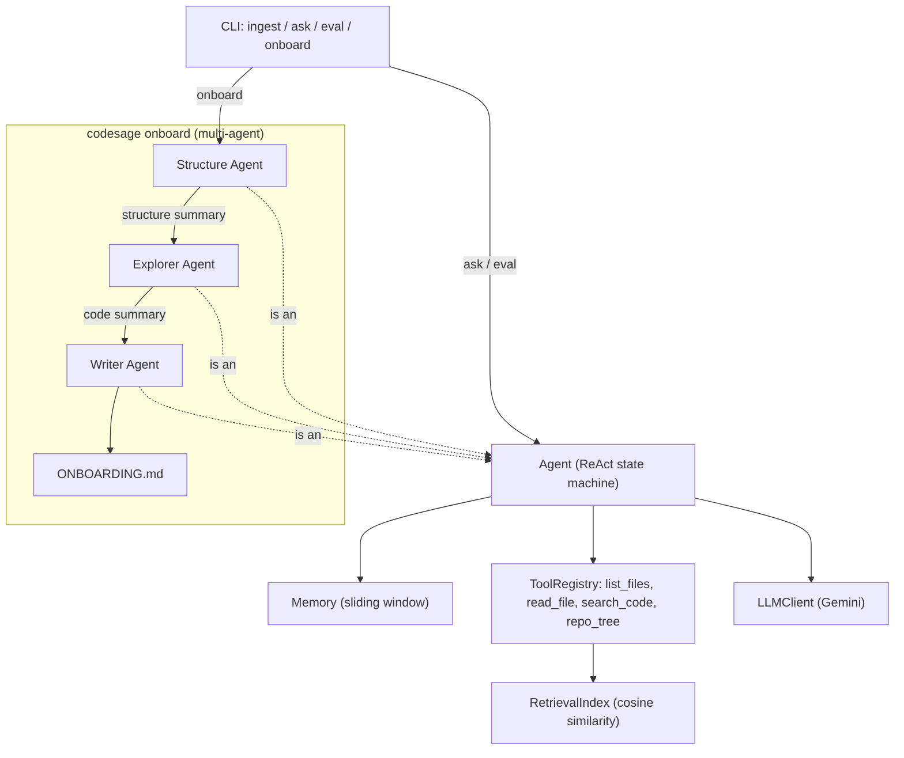

# Multi-Agent Onboarding Doc Generator Implementation Plan

> **For agentic workers:** REQUIRED SUB-SKILL: Use superpowers:subagent-driven-development (recommended) or superpowers:executing-plans to implement this plan task-by-task. Steps use checkbox (`- [ ]`) syntax for tracking.

**Goal:** Add `codesage onboard --repo <path>`, a sequential 3-agent pipeline (structure mapper → code explorer → writer) that produces `ONBOARDING.md` for any repo.

**Architecture:** Each stage is a plain `Agent` instance (no new agent primitive) — a "role" is expressed only through which tools it's given and the task text it's asked. A new `codesage/supervisor.py` module owns the pipeline; one small refactor (`build_base_registry` moves from `cli.py` to `tools.py`) avoids a circular import between `cli.py` and the new module.

**Tech Stack:** Same as the existing project — Python 3.13, `google-genai`, `pytest`. No new dependencies.

## Global Constraints

- Spec: `docs/superpowers/specs/2026-08-20-multi-agent-onboarding-design.md` — every task implements one piece of it.
- Sequential pipeline only — no concurrency, no `asyncio`.
- `Agent`/`LLMClient` are not modified. Sub-agent "roles" live entirely in tool selection + prompt text.
- All new logic is unit-tested against the existing `FakeLLM` double pattern (see `tests/test_agent.py`), not real API calls — except the one `@pytest.mark.integration` test in Task 5.
- Decisions log at `docs/superpowers/decisions/2026-08-20-multi-agent-onboarding-decisions.md` (already gitignored). **Every task ends with an entry appended to it. Never `git add` this file — verify with `git status` before each commit that it is not staged.**
- `repo_tree` output is capped at 200 entries, then appends `"... (truncated)"`.

---

### Task 1: Move `build_base_registry` from `cli.py` to `tools.py`

**Why this task exists:** `supervisor.py` (Task 3) needs `build_base_registry` to build the explorer agent's tool set. `cli.py` will need to import `generate_onboarding_doc` from `supervisor.py` (Task 4). If `build_base_registry` stays in `cli.py`, that's a circular import (`cli.py` → `supervisor.py` → `cli.py`). Moving it to `tools.py` — which nothing else depends on — breaks the cycle. This is a pure relocation: same function body, same signature, three call sites updated.

**Files:**
- Modify: `codesage/tools.py` (add the function)
- Modify: `codesage/cli.py:16-48` (remove the function, update import)
- Modify: `codesage/api.py:65` (update import path)
- Modify: `tests/test_integration.py:14` (update import path)

**Interfaces:**
- Produces: `build_base_registry(base_dir: Path) -> ToolRegistry` — now defined in `codesage.tools`. Same signature as before; every caller's behavior is unchanged.

- [ ] **Step 1: Add `build_base_registry` to `codesage/tools.py`**

Add this function to the end of `codesage/tools.py` (after `make_search_code_tool`):

```python
def build_base_registry(base_dir: Path) -> ToolRegistry:
    registry = ToolRegistry()
    registry.register(
        Tool(
            name="list_files",
            description="List files under a directory relative to the target repo root.",
            parameters_schema={
                "type": "object",
                "properties": {"subdir": {"type": "string", "description": "Relative subdirectory, use '.' for root"}},
                "required": ["subdir"],
            },
            handler=lambda subdir: list_files_handler(base_dir, subdir),
        )
    )
    registry.register(
        Tool(
            name="read_file",
            description="Read a file's contents by path relative to the target repo root, optionally a line range.",
            parameters_schema={
                "type": "object",
                "properties": {
                    "path": {"type": "string"},
                    "start_line": {"type": "integer"},
                    "end_line": {"type": "integer"},
                },
                "required": ["path"],
            },
            handler=lambda path, start_line=None, end_line=None: read_file_handler(
                base_dir, path, start_line, end_line
            ),
        )
    )
    return registry
```

- [ ] **Step 2: Remove it from `codesage/cli.py` and update the import**

Delete lines 16-48 (the `build_base_registry` function) from `codesage/cli.py`.

Change the import line:
```python
from codesage.tools import Tool, ToolRegistry, list_files_handler, read_file_handler, make_search_code_tool
```
to:
```python
from codesage.tools import build_base_registry
```
(`Tool`, `ToolRegistry`, `list_files_handler`, `read_file_handler` are no longer referenced directly in `cli.py` — only `make_search_code_tool` still is, so also keep that import: the final line should be
`from codesage.tools import build_base_registry, make_search_code_tool`.)

- [ ] **Step 3: Update `codesage/api.py:65`**

Change:
```python
    from codesage.cli import build_base_registry
```
to:
```python
    from codesage.tools import build_base_registry
```

- [ ] **Step 4: Update `tests/test_integration.py:14`**

Change:
```python
from codesage.cli import build_base_registry
```
to:
```python
from codesage.tools import build_base_registry
```

- [ ] **Step 5: Run the full test suite to verify nothing broke**

Run: `uv run pytest -v`
Expected: same pass count as before this task (33 passed, 1 deselected) — this task adds no new tests, it's a pure refactor. If anything fails, the import update was incomplete somewhere.

- [ ] **Step 6: Append a decisions log entry**

Append to `docs/superpowers/decisions/2026-08-20-multi-agent-onboarding-decisions.md` (create the file if it doesn't exist yet):

```markdown
## Task 1: Moved build_base_registry to tools.py

Decision: relocate `build_base_registry` from `cli.py` to `tools.py` before
writing `supervisor.py`, rather than after hitting the circular import.

Why: `supervisor.py` needs it to build the explorer agent's registry, and
`cli.py` needs to import `generate_onboarding_doc` from `supervisor.py` for
the new `onboard` command. Both directions can't hold at once if the
function stays in `cli.py`. `tools.py` is a leaf module nothing else in
the project depends on, so it's the natural home — it already hosts
`make_search_code_tool`, another registry-building factory.
```

- [ ] **Step 7: Commit**

```bash
git status  # confirm docs/superpowers/decisions/ is NOT listed
git add codesage/tools.py codesage/cli.py codesage/api.py tests/test_integration.py
git commit -m "refactor: move build_base_registry to tools.py

Breaks a circular import between cli.py and the upcoming supervisor.py
module — both need this factory, so it moves to tools.py, a leaf module
neither of them is depended on by."
```

---

### Task 2: `repo_tree` tool

**Concept:** A recursive directory walk (DFS) producing an indented tree view — the same `SKIP_DIRS` filter as `ingest.py`, bounded output (200 entries) so a huge repo can't blow up the context window, same idea as `Memory`'s sliding window.

**Files:**
- Modify: `codesage/tools.py` (add `repo_tree_handler` and its constant)
- Test: `tests/test_tools.py` (add tests)

**Interfaces:**
- Consumes: `SKIP_DIRS` from `codesage.ingest` (already defined there).
- Produces: `repo_tree_handler(base_dir: Path, subdir: str = ".") -> str`. Task 3 wires this into a `Tool` named `"repo_tree"`.

- [ ] **Step 1: Write the failing tests**

Add to `tests/test_tools.py`:

```python
from codesage.tools import repo_tree_handler


def test_repo_tree_handler_shows_nested_structure(tmp_path: Path):
    (tmp_path / "pkg").mkdir()
    (tmp_path / "pkg" / "mod.py").write_text("x = 1")
    (tmp_path / "readme.md").write_text("# hi")

    result = repo_tree_handler(tmp_path, ".")

    assert "pkg/" in result
    assert "mod.py" in result
    assert "readme.md" in result


def test_repo_tree_handler_skips_skip_dirs(tmp_path: Path):
    (tmp_path / "a.py").write_text("x = 1")
    git_dir = tmp_path / ".git"
    git_dir.mkdir()
    (git_dir / "config").write_text("ignored")

    result = repo_tree_handler(tmp_path, ".")

    assert ".git" not in result
    assert "config" not in result


def test_repo_tree_handler_truncates_past_200_entries(tmp_path: Path):
    for i in range(250):
        (tmp_path / f"file_{i:03d}.py").write_text("x = 1")

    result = repo_tree_handler(tmp_path, ".")

    assert "... (truncated)" in result
    assert result.count("file_") == 200


def test_repo_tree_handler_blocks_path_escape(tmp_path: Path):
    result = repo_tree_handler(tmp_path, "../../etc")
    assert result.startswith("Error")
```

- [ ] **Step 2: Run tests to verify they fail**

Run: `uv run pytest tests/test_tools.py -v`
Expected: FAIL — `ImportError: cannot import name 'repo_tree_handler'`

- [ ] **Step 3: Add `repo_tree_handler` to `codesage/tools.py`**

Add this import at the top of `codesage/tools.py` (alongside the existing imports):

```python
from codesage.ingest import SKIP_DIRS
```

Add this constant and function (after `read_file_handler`, before `make_search_code_tool`):

```python
_MAX_TREE_ENTRIES = 200


def repo_tree_handler(base_dir: Path, subdir: str = ".") -> str:
    target = (base_dir / subdir).resolve()
    if not str(target).startswith(str(Path(base_dir).resolve())):
        return "Error: path escapes the target repo."
    if not target.exists():
        return f"Error: {subdir} does not exist."

    lines: list[str] = []
    count = 0
    truncated = False

    def walk(dir_path: Path, prefix: str) -> None:
        nonlocal count, truncated
        if truncated:
            return
        entries = sorted(dir_path.iterdir(), key=lambda p: (p.is_file(), p.name))
        for entry in entries:
            if entry.is_dir() and entry.name in SKIP_DIRS:
                continue
            if count >= _MAX_TREE_ENTRIES:
                truncated = True
                return
            lines.append(f"{prefix}{entry.name}{'/' if entry.is_dir() else ''}")
            count += 1
            if entry.is_dir():
                walk(entry, prefix + "  ")

    walk(target, "")
    if truncated:
        lines.append("... (truncated)")
    return "\n".join(lines) if lines else "(empty directory)"
```

- [ ] **Step 4: Run tests to verify they pass**

Run: `uv run pytest tests/test_tools.py -v`
Expected: PASS (all tests, including the 4 new ones)

- [ ] **Step 5: Run the full suite**

Run: `uv run pytest -v`
Expected: all pass, no regressions from the new `SKIP_DIRS` import.

- [ ] **Step 6: Append a decisions log entry**

```markdown
## Task 2: repo_tree tool — recursion + bounded output

Decision: implement repo_tree as a recursive DFS with a nested `walk()`
closure and a nonlocal counter, rather than an iterative stack-based
walk, and cap it at 200 entries with a truncation marker instead of
returning everything.

Why: DFS via recursion is the most direct way to express "list this
directory, then recurse into each subdirectory" — it mirrors how a
human would describe the algorithm. The 200-entry cap exists for the
same reason Memory uses a bounded sliding window: an agent tool that
returns unbounded output for a large repo could overflow the model's
context on the very first call, before the agent even gets to reason
about anything.
```

- [ ] **Step 7: Commit**

```bash
git status  # confirm docs/superpowers/decisions/ is NOT listed
git add codesage/tools.py tests/test_tools.py
git commit -m "feat: add repo_tree tool

Recursive directory walk (DFS), same SKIP_DIRS filter as ingestion,
capped at 200 entries — gives the structure-mapping agent a full-repo
view in one call instead of many list_files round trips."
```

---

### Task 3: `codesage/supervisor.py` — the 3-agent pipeline

**Files:**
- Create: `codesage/supervisor.py`
- Test: `tests/test_supervisor.py`

**Interfaces:**
- Consumes: `Agent(llm, tools=None, memory=None, max_steps=8)` from `codesage.agent`; `Tool`, `ToolRegistry`, `build_base_registry`, `repo_tree_handler`, `make_search_code_tool` from `codesage.tools`; `INDEX_FILENAME`, `RetrievalIndex`, `load_chunks` from `codesage.index`.
- Produces: `generate_onboarding_doc(repo_path: Path, llm) -> str` — the CLI (Task 4) calls this directly. Also produces `build_structure_registry(repo_path: Path) -> ToolRegistry` (unconditional tool set, covered indirectly through the orchestration test — no branching logic to warrant its own test) and `build_explorer_registry(repo_path: Path, llm) -> ToolRegistry` (has real conditional logic — whether `search_code` gets registered — so it gets two direct tests, see below).

- [ ] **Step 1: Write the failing tests**

Create `tests/test_supervisor.py`:

```python
from pathlib import Path
from types import SimpleNamespace

import pytest

from codesage.index import INDEX_FILENAME, save_chunks
from codesage.ingest import Chunk
from codesage.supervisor import build_explorer_registry, generate_onboarding_doc


class FakeLLM:
    def __init__(self, responses):
        self._responses = list(responses)
        self.calls = []

    def generate(self, contents, tools=None):
        self.calls.append({"contents": contents, "tools": tools})
        return self._responses.pop(0)


def _text_response(text: str) -> SimpleNamespace:
    return SimpleNamespace(text=text, function_calls=None)


def test_generate_onboarding_doc_runs_three_stages_in_order(tmp_path: Path):
    (tmp_path / "a.py").write_text("x = 1")

    fake_llm = FakeLLM([
        _text_response("STRUCTURE SUMMARY"),
        _text_response("CODE SUMMARY"),
        _text_response("# Final Doc"),
    ])

    doc = generate_onboarding_doc(tmp_path, fake_llm)

    assert doc == "# Final Doc"
    assert len(fake_llm.calls) == 3

    explorer_prompt = fake_llm.calls[1]["contents"][0].parts[0].text
    assert "STRUCTURE SUMMARY" in explorer_prompt

    writer_prompt = fake_llm.calls[2]["contents"][0].parts[0].text
    assert "STRUCTURE SUMMARY" in writer_prompt
    assert "CODE SUMMARY" in writer_prompt


def test_build_explorer_registry_includes_search_code_when_index_exists(tmp_path: Path):
    chunk = Chunk(text="auth code", file_path="auth.py", line_start=1, line_end=5, vector=[1.0, 0.0])
    save_chunks([chunk], tmp_path / INDEX_FILENAME)

    registry = build_explorer_registry(tmp_path, llm=FakeLLM([]))

    assert registry.get("search_code") is not None


def test_build_explorer_registry_omits_search_code_without_index(tmp_path: Path):
    registry = build_explorer_registry(tmp_path, llm=FakeLLM([]))

    with pytest.raises(KeyError):
        registry.get("search_code")
```

- [ ] **Step 2: Run tests to verify they fail**

Run: `uv run pytest tests/test_supervisor.py -v`
Expected: FAIL — `ModuleNotFoundError: No module named 'codesage.supervisor'`

- [ ] **Step 3: Write `codesage/supervisor.py`**

```python
"""Multi-agent pipeline: structure mapper -> code explorer -> writer.

A "role" here is just which tools an agent gets and what task text it's
asked — every stage is a plain Agent instance, the same class used for
`codesage ask`. Multi-agent composes an already-tested primitive; it
doesn't introduce a new one.
"""

from pathlib import Path

from codesage.agent import Agent
from codesage.index import INDEX_FILENAME, RetrievalIndex, load_chunks
from codesage.tools import (
    Tool,
    ToolRegistry,
    build_base_registry,
    make_search_code_tool,
    repo_tree_handler,
)

STRUCTURE_PROMPT = (
    "Explore this repository's directory layout using the available tools. "
    "Produce a concise plain-text summary covering: the overall structure, "
    "the main modules/packages, and likely entry points (e.g. a CLI, an "
    "__init__.py, a main script). Do not read every file in depth — this "
    "is a map, not a deep analysis."
)

EXPLORER_PROMPT_TEMPLATE = (
    "Here is a summary of this repository's structure:\n\n{structure_summary}\n\n"
    "Using that as a guide, explore the key modules and explain what they "
    "actually do — the core logic, important classes/functions, and how "
    "the pieces fit together. Focus on what someone would need to "
    "understand before making their first change."
)

WRITER_PROMPT_TEMPLATE = (
    "Write a single onboarding markdown document for this repository, "
    "combining two things: (1) orientation — what this repo is, how it's "
    "organized, where to start reading; and (2) contribution guidance — "
    "how to set it up, how to run tests, where common changes tend to "
    "happen. Use the research below. Output only the markdown document, "
    "no commentary about the task itself.\n\n"
    "## Structure summary\n{structure_summary}\n\n"
    "## Code summary\n{code_summary}"
)

_STRUCTURE_MAX_STEPS = 6
_EXPLORER_MAX_STEPS = 10
_WRITER_MAX_STEPS = 3


def build_structure_registry(repo_path: Path) -> ToolRegistry:
    registry = build_base_registry(repo_path)
    registry.register(
        Tool(
            name="repo_tree",
            description="Show a recursive directory tree of the target repo, relative to its root.",
            parameters_schema={
                "type": "object",
                "properties": {"subdir": {"type": "string", "description": "Relative subdirectory, use '.' for root"}},
                "required": ["subdir"],
            },
            handler=lambda subdir: repo_tree_handler(repo_path, subdir),
        )
    )
    return registry


def build_explorer_registry(repo_path: Path, llm) -> ToolRegistry:
    registry = build_base_registry(repo_path)
    index_path = repo_path / INDEX_FILENAME
    if index_path.exists():
        chunks = load_chunks(index_path)
        index = RetrievalIndex(chunks)
        registry.register(make_search_code_tool(index, llm))
    return registry


def generate_onboarding_doc(repo_path: Path, llm) -> str:
    structure_agent = Agent(llm, tools=build_structure_registry(repo_path), max_steps=_STRUCTURE_MAX_STEPS)
    structure_summary = structure_agent.ask(STRUCTURE_PROMPT)

    explorer_agent = Agent(llm, tools=build_explorer_registry(repo_path, llm), max_steps=_EXPLORER_MAX_STEPS)
    code_summary = explorer_agent.ask(EXPLORER_PROMPT_TEMPLATE.format(structure_summary=structure_summary))

    writer_agent = Agent(llm, max_steps=_WRITER_MAX_STEPS)
    return writer_agent.ask(
        WRITER_PROMPT_TEMPLATE.format(structure_summary=structure_summary, code_summary=code_summary)
    )
```

- [ ] **Step 4: Run tests to verify they pass**

Run: `uv run pytest tests/test_supervisor.py -v`
Expected: PASS (all 3 tests)

- [ ] **Step 5: Run the full suite**

Run: `uv run pytest -v`
Expected: all pass — this task only adds new files, touches nothing existing.

- [ ] **Step 6: Append a decisions log entry**

```markdown
## Task 3: supervisor.py — why no new Agent subclass or role parameter

Decision: build_structure_registry / build_explorer_registry are plain
functions returning a ToolRegistry; generate_onboarding_doc constructs
three ordinary Agent instances back to back. No AgentRole enum, no
subclassing, no change to Agent's constructor.

Why: the only thing that varies between "structure mapper," "explorer,"
and "writer" is which tools they hold and what question they're asked —
both of which Agent already parameterizes. Adding a role concept on top
would model something that doesn't actually change Agent's behavior,
just its inputs. Each Agent's memory is also naturally isolated (a new
instance per stage) — no cross-stage memory sharing to worry about,
unlike the eval.py/api.py bug from the original build, because each
sub-agent here is only ever asked once.
```

- [ ] **Step 7: Commit**

```bash
git status  # confirm docs/superpowers/decisions/ is NOT listed
git add codesage/supervisor.py tests/test_supervisor.py
git commit -m "feat: add multi-agent onboarding pipeline (supervisor.py)

Sequential 3-stage pipeline — structure mapper, code explorer, writer —
each a plain Agent instance. Explorer only gets search_code if a
persisted index exists, matching the CLI ask command's existing
graceful-degradation pattern."
```

---

### Task 4: CLI `onboard` command

**Files:**
- Modify: `codesage/cli.py`

**Interfaces:**
- Consumes: `generate_onboarding_doc(repo_path, llm) -> str` from `codesage.supervisor`.

- [ ] **Step 1: Add the subparser**

In `codesage/cli.py`, in `main()`, after the `eval_parser` block:

```python
    onboard_parser = subparsers.add_parser("onboard")
    onboard_parser.add_argument("--repo", default=".", help="Target repo path")
```

- [ ] **Step 2: Add the command branch**

After the `elif args.command == "eval":` block's body, add:

```python
    elif args.command == "onboard":
        from codesage.supervisor import generate_onboarding_doc

        repo_path = Path(args.repo)
        doc = generate_onboarding_doc(repo_path, llm)
        output_path = repo_path / "ONBOARDING.md"
        output_path.write_text(doc)
        print(f"Wrote onboarding doc to {output_path}")
```

- [ ] **Step 3: Run the full suite**

Run: `uv run pytest -v`
Expected: all pass — argparse wiring isn't unit tested directly (matches the existing convention: `main()` itself has no direct test, only the functions it calls do).

- [ ] **Step 4: Manual smoke test with the real API**

Run: `uv run codesage onboard --repo target_repo/src`
Expected: prints `Wrote onboarding doc to target_repo/src/ONBOARDING.md`; open that file and confirm it reads as a real, sensible onboarding doc for the `requests` library (mentions Session, HTTPAdapter, or similar real symbols — not generic filler).

- [ ] **Step 5: Append a decisions log entry**

```markdown
## Task 4: onboard writes to ONBOARDING.md, doesn't print to stdout

Decision: the doc gets written to a file in the target repo, with a
one-line confirmation printed — not dumped to stdout like `ask` does.

Why: `ask` answers are short, meant to be read directly in the terminal.
An onboarding doc is long-form content meant to be opened, read, and
potentially committed to the target repo — a file is the right shape
for that, not a stdout dump you'd have to redirect yourself.
```

- [ ] **Step 6: Commit**

```bash
git status  # confirm docs/superpowers/decisions/ is NOT listed
git add codesage/cli.py
git commit -m "feat: add codesage onboard CLI command

Runs the 3-agent pipeline and writes ONBOARDING.md into the target repo."
```

---

### Task 5: Integration test

**Files:**
- Modify: `tests/test_integration.py`

- [ ] **Step 1: Add the test**

Append to `tests/test_integration.py`:

```python
from codesage.supervisor import generate_onboarding_doc

TARGET_REPO_SRC = Path(__file__).parent.parent / "target_repo" / "src"


@pytest.mark.integration
def test_generate_onboarding_doc_against_real_repo():
    api_key = os.environ.get("GEMINI_API_KEY")
    if not api_key:
        pytest.skip("GEMINI_API_KEY not set")
    if not TARGET_REPO_SRC.exists():
        pytest.skip("target_repo/src not present locally")

    llm = LLMClient(api_key=api_key)
    doc = generate_onboarding_doc(TARGET_REPO_SRC, llm)

    assert "requests" in doc.lower()
```

- [ ] **Step 2: Run it against the real API**

Run: `uv run pytest tests/test_integration.py -m integration -v`
Expected: PASS (both integration tests: the existing fixture-repo one and this new one)

- [ ] **Step 3: Confirm the default run still excludes it**

Run: `uv run pytest -v`
Expected: the new test does not appear in the output (excluded by `-m 'not integration'`)

- [ ] **Step 4: Append a decisions log entry**

```markdown
## Task 5: integration test skips if target_repo/src is missing

Decision: added a second skip condition (`target_repo/src` not present),
not just the existing GEMINI_API_KEY check.

Why: target_repo/ is gitignored — a clean checkout of this repo won't
have it. CI already can't run integration tests (no API key), but a
human running `pytest -m integration` locally without having cloned/
ingested a target repo yet would otherwise get a confusing FileNotFoundError
instead of a clear skip reason.
```

- [ ] **Step 5: Commit**

```bash
git status  # confirm docs/superpowers/decisions/ is NOT listed
git add tests/test_integration.py
git commit -m "test: add integration test for the onboarding pipeline"
```

---

### Task 6: README visual refresh + document `onboard`

**Files:**
- Modify: `README.md`

- [ ] **Step 1: Add badges near the top**

Right after the `# CodeSage` heading, add:

```markdown


```

- [ ] **Step 2: Add a Mermaid architecture diagram**

Add a new `## Architecture diagram` section right before the existing `## Architecture` table:

````markdown
## Architecture diagram


````

- [ ] **Step 3: Add a row to the architecture table**

In the existing `## Architecture` table, add:

```markdown
| `supervisor.py` | Multi-agent pipeline for `codesage onboard` — structure mapper → code explorer → writer, each a plain `Agent` instance. |
```

Also update the `tools.py` row to mention the new tool:

```markdown
| `tools.py` | `ToolRegistry` — a `dict[str, Tool]` the agent dispatches through by name. Also `build_base_registry` (shared tool set) and `repo_tree` (recursive directory view). |
```

- [ ] **Step 4: Document the command in the Usage section**

In the existing `## Usage` code block, add:

```bash
uv run codesage onboard --repo <path-to-a-repo>       # generates ONBOARDING.md
```

- [ ] **Step 5: Run the full suite one more time**

Run: `uv run pytest -v`
Expected: all pass — this task is documentation-only.

- [ ] **Step 6: Append a final decisions log entry**

```markdown
## Task 6: README — Mermaid over a static image

Decision: architecture diagram is a Mermaid code block, not a generated
PNG/SVG committed to the repo.

Why: GitHub renders Mermaid natively in README.md — no build step, no
stale-image-after-a-refactor problem, and it's just as visually
legible in the rendered page as a static image would be, at zero
maintenance cost.
```

- [ ] **Step 7: Commit and push**

```bash
git status  # confirm docs/superpowers/decisions/ is NOT listed
git add README.md
git commit -m "docs: visual refresh + document the onboard command

Adds CI/Python badges and a Mermaid architecture diagram showing both
the single-agent (ask/eval) and multi-agent (onboard) paths."
git push
```

---

## After all 6 tasks

- `codesage onboard --repo <path>` works end to end, verified against `target_repo/src`.
- Full suite green (existing + new tests), CI green on every commit.
- Decisions log at `docs/superpowers/decisions/2026-08-20-multi-agent-onboarding-decisions.md` has one entry per task, exists only locally.
- README documents the new command and has a real architecture diagram.
- Natural v2 idea, out of scope here: vectorless retrieval as a second `search_code` strategy (separate spec, per the design doc).
